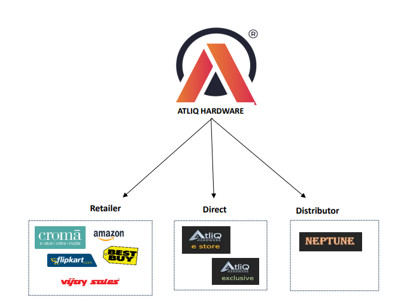

# Sales and Finance Analytics

## Introduction about AtliQ Hardwares

- AtliQ Hardware is a company that specializes in selling a wide range of hardware products, including personal computers, mice, printers, and various other peripheral devices. Their diverse product lineup appeals to a broad range of customers.

- AtliQ not only sells these hardware goods but also manufactures them. To make these products available to customers, they use intermediaries. These intermediaries can be physical retail giants like Croma and Best Buy and popular online marketplaces such as Flipkart and Amazon.

- These intermediaries play a crucial role as they serve as a bridge connecting Atliq's products with the end consumers, effectively making these products accessible to the general public.

## AtliQ Business Models

## Project Objectives

This project is focused on achieving the following key objectives:

## Sales Report
**1. Customer Performance Report:**

- Create a detailed analysis of customer performance over the years, highlighting sales figures and growth percentages.

**2. Market Performance and Sales Targets Comparison:**

- Conduct a comprehensive comparison between market performance and sales targets, providing insights into the success of sales strategies.

## Finance Report
**1. Profit and Loss (P&L) Reports by Fiscal Year and Months:**

- Generate Profit and Loss reports categorized by fiscal year and months to evaluate financial performance over different time frames.

**2. Profit and Loss (P&L) Reports by Markets:**

- Create Profit and Loss reports categorized by markets to aid in benchmarking against industry peers and previous periods.

## Brief Gist of Technical Skills:
- **Data Analysis Techniques:** Utilized ETL (Extract, Transform, Load) methodology for processing data efficiently.
- **Power Query:** Demonstrated proficiency in generating a date table and deriving fiscal months and quarters.
- **Power Pivot:** Established data model relationships and incorporated supplementary data effectively.
- **DAX (Data Analysis Expressions):** Used DAX to create calculated columns for advanced analytics.

## Soft Skills

- **Report Design:** Developed a refined understanding of designing user-centric reports with empathy in mind.
- **Optimization:** Acquired skills in optimizing report generation through meticulous fine-tuning.
- **Systematic Approach:** Developed a systematic approach to devising a report-building plan, enhancing efficiency.

## Project Management

- **Strategic Thinking:** Aligned financial planning with strategic goals, contributing to a comprehensive understanding of organizational financial outlook.
- **Communication:** Improved communication skills by presenting complex financial data in a clear and understandable format.

## Contionous Learning

- **Adaptability:** Embraced new tools and techniques, showcasing adaptability in a dynamic work environment.

## Conclusion

This project not only allowed me to apply my technical skills but also provided a platform for continuous learning and improvement. The experience gained is instrumental in my journey as a data professional, and I look forward to applying these skills in future projects.
